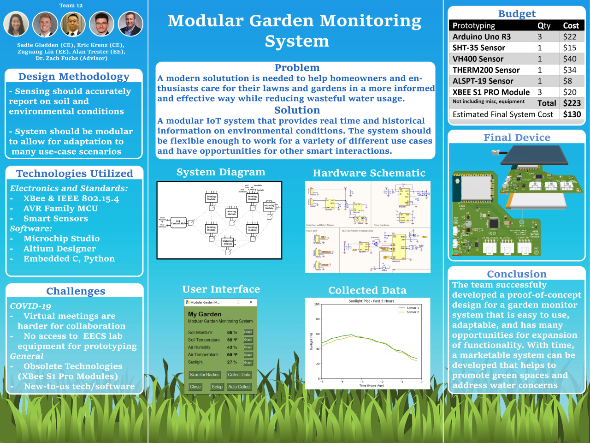
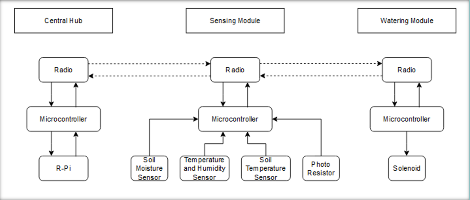
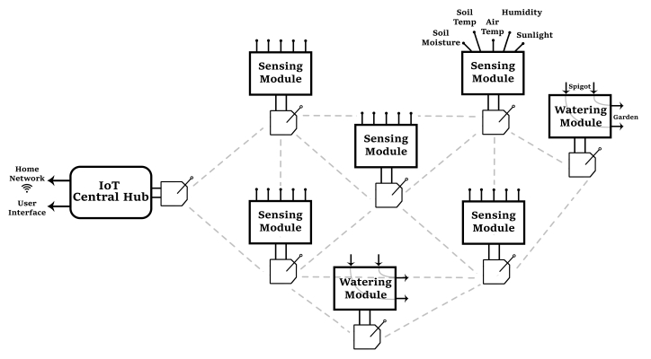

# Modular Garden Monitoring System
Senior Capstone Design Project

*EECS Department, CEAS College, University of Cincinnati*

**Team CE12**
- Sadie Gladden (gladdesm@mail.uc.edu)
- Alan Trester (tresteat@mail.uc.edu)
- Liu / Zuguang Liu (liu2z2@mail.uc.edu)
- Eric Krenz (krenzew@mail.uc.edu)
- Technical advisor: Dr. Zachariah Fuchs (fuchsze@ucmail.uc.edu)
- Academic instructor: Dr. Carla Purdy (purdycc@ucmail.uc.edu)

## Project Description
The MGMS is an IoT solution to help homeowners, garden enthusiasts, and farmers care for their lawns and gardens in a more informed and effective way while also reducing wasteful water usage.

Our proposed solution is a modular design consisting of a central hub which will wirelessly connect to multiple sensing and watering modules that can be placed around a garden or house.
The hub hosts the central user interface and allow for customizing different garden setups.
The hub software will make decisions based on the user configuration to control connected field modules in order to continuously monitor and water the garden.
The user interface will be able to alert the user to garden events and make suggestions based on information available on the internet.
The most important feature of the system should be modularity in freedom to interface a variety of system components in many different configurations.

System Control Scheme | System Network Topology
:---: | :---:
 | 

Being a self-proposed project, this proof-of-concept system was designed over the 2020 - 2021 academic year to fulfill the team's senior design requirement.
At the end, we were able to deliver part of the implementation, including the sensor module [hardware design](design/sensor-module/) and its [firmware](src/cpp-sensor-module/), as well as the [user application](src/python-gui/) at the front end.

For detailed information, see our [virtual poster site](https://mgmsteam12.weebly.com/) and related [documents](docs).

## Directory Structure
    .
    ├── design                      # Hardware design root dir
    │   └── sensor-module           # design files for sensor module
    ├── src                         # Software source root dir
    |   ├── cpp-sensor-module       # sensor module firmware
    |   ├── python-gui              # frontend application
    |   └── make-avr-template       # makefile template for avr-gcc
    └── docs

## License
This project is licensed under the [MIT License](LICENSE).