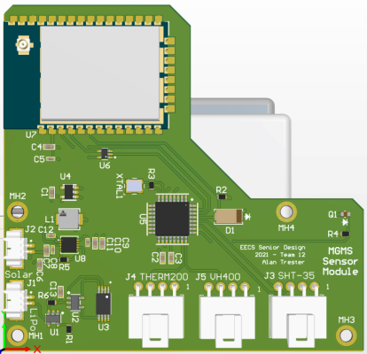
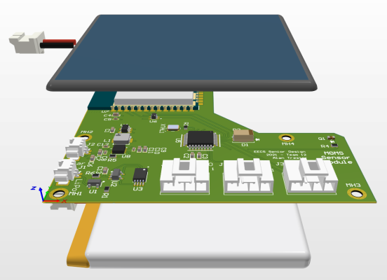
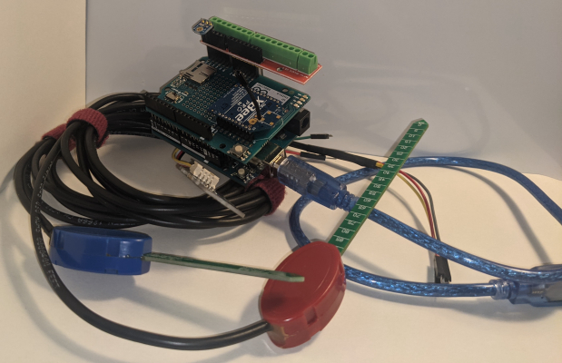
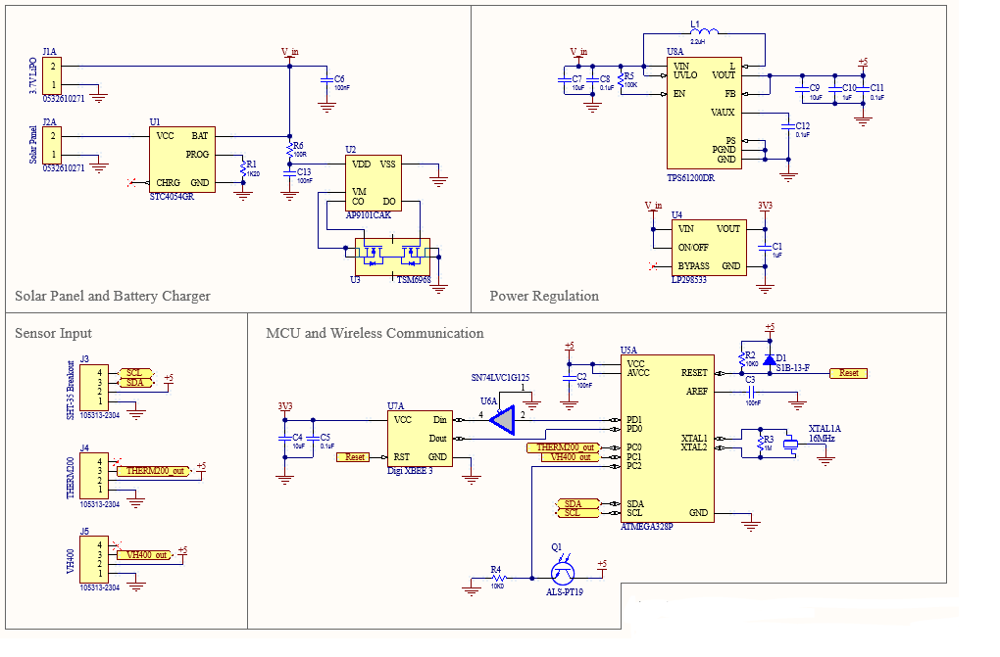

Here we share the circuit schematics and PCB designs used for the project.

# Sensor Module with Solar Power
## Components
The sensor module serves as a client device to the central hub, sending necessary local environment information with a scheduled routine.
Key components include:
- Multiple low-power sensors with high precision relative to the application
- XBee radio module that uses [IEEE 802.15.4](https://en.wikipedia.org/wiki/IEEE_802.15.4) industry IoT standard
- Microcontroller unit whose program is easily portable to many devices of similar architecture
- Managed power system with regulator, solar panel and lithium-ion battery pack

Detailed component list see [Bill of Material](sensor-module/BoM.csv).

## Result Showcase
Limited by time constraints and component availability, we were not able to fabricate the PCB for the final delivery.
However, as a proof of concept, we managed to assemble an [alpha-prototype](sensor-module/img/prototype.jpg) to simulate the system operation with the same component but in different packages used in PCB.
This alpha-prototype, proven functional, was demonstrated in [our virtual senior design exposition site](https://mgmsteam12.weebly.com/).
Moving forward, if the project is picked up for further development, we would like to see the PCB fabricated, assembled and field-tested.

Following figures demonstrate a 3D mockup of the device as well as the alpha-prototype.
The PCB was designed in such a way that it could tightly fit into a handhold-sized weatherproof enclosure, interfaced with a similar-sized solar panel and lithium-ion battery pack.
The system's sunlight sensor and radio antenna are cautiously positioned to avoid being obstructed by other components.

Top View | Side View | Prototype
:---: | :---: | :---:
 |  | 

## Open-Sourced Design
During the development, we have received great help from the open-source community to piece together a functional and dependable circuit.
We would like to show our gratitude by sharing our design as well.
The design was developed natively in [Altium Designer 21](https://www.altium.com/documentation/altium-designer/new-in-altium-designer?version=21).
Files related to the circuit schematic and PCB layout can be found under [`sensor-module`](sensor-module).

## KiCAD Port
The design was ported in KiCAD thanks to thesourcerer8's `altium2kicad` script. Follow [this link](https://github.com/thesourcerer8/altium2kicad) to learn more about the script, which was not included here due to license issues.
The ported files are available under [`sensor-module/kicad-port`](sensor-module/kicad-port). They are tested functional with no error in Version 5.1.9 Linux build, but with minor glitches that were not yet fixed as of now.

# Future Work
Apart from the sensor module, we would also like to see a packaged design for the central hub. This will be marked as work in progress.