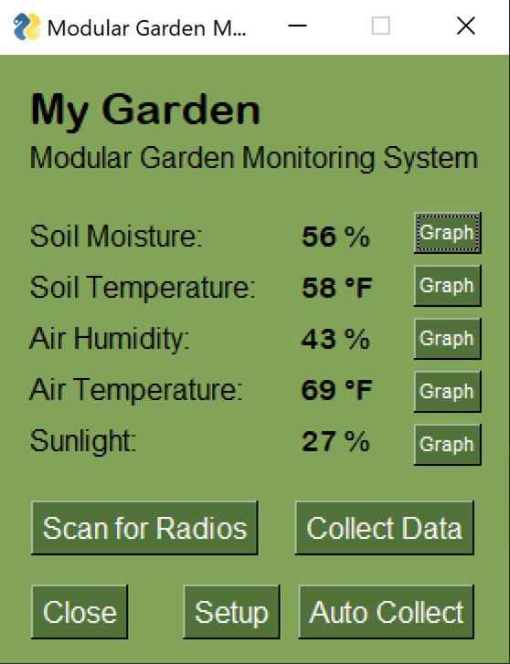
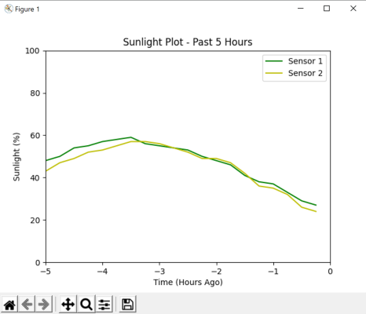

Source code for the GUI front-end for the project, developed by Sadie and Eric.

# Dependencies
There is a conda environment with all dependencies available in `environment.yml`, tested on Linux platform. See [managing conda convirnments](https://docs.conda.io/projects/conda/en/latest/user-guide/tasks/manage-environments.html). However, as of now, the required packages are as minimal as listed below.

- [Numpy](https://numpy.org/install/)
- [matplotlib](https://matplotlib.org/stable/users/installing.html)
- [pathlib](https://docs.python.org/3.6/library/pathlib.html)
- [PySimpleGUI](https://pysimplegui.readthedocs.io/en/latest/#install)
- [pySerial](https://github.com/pyserial/pyserial)

It is expected to work easily after installing these packages for any Python 3.6+ on any platform.

# Usage
Simply run `mgms.py` as main renders the GUI window similar to [this](img/gui-main.png).

# Test Helpers
`test-helpers/data_maker.py` helps to generate data in the correct format for GUI testing.

# WIP Parts
There are a few TO-DO's in the code that has not yet implemented due to the time constraints for the final delivery. We expect to come back later for future work.