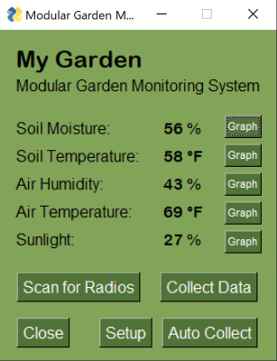
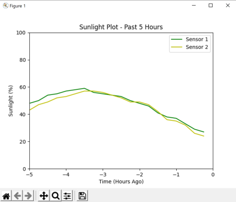

# Central Hub Application
Source code for the GUI front-end for the project, developed in Python by Sadie and Eric.

Landing Page | Sensor vs Time Graph
:---: | :---:
 | 

## Dependencies
The source was developed on Windows with Python 3.8.
As of now, the required packages are as minimal as listed below.

- [Numpy](https://numpy.org/install/)
- [matplotlib](https://matplotlib.org/stable/users/installing.html)
- [pathlib](https://docs.python.org/3.6/library/pathlib.html)
- [PySimpleGUI](https://pysimplegui.readthedocs.io/en/latest/#install)
- [pySerial](https://github.com/pyserial/pyserial)

It is expected to work easily after installing these packages for any Python 3.8+ on any platform.

There is also a conda environment with all dependencies available in `environment.yml`, tested on Linux platform. See [managing conda convirnments](https://docs.conda.io/projects/conda/en/latest/user-guide/tasks/manage-environments.html).

## Usage
### Main Program
Simply running `mgms.py` as main renders the GUI window similar to [this](img/gui-main.png).

### Test Helpers
`test-helpers/data_maker.py` helps to generate data in the correct format for GUI testing.

### `tkinter` Error on Linux
In some version of the PySimpleGUI, there is error from `tkinter` depending on the shell used:
```
_tkinter.TclError: no display name and no $DISPLAY environment variable
```
One working solution is execute `export DISPLAY=:0` in the same session of shell before running the code.

## Work in Progress
There are a few TO-DO's in the code that has not yet implemented due to the time constraints for the final delivery.
We expect to come back later for future work.